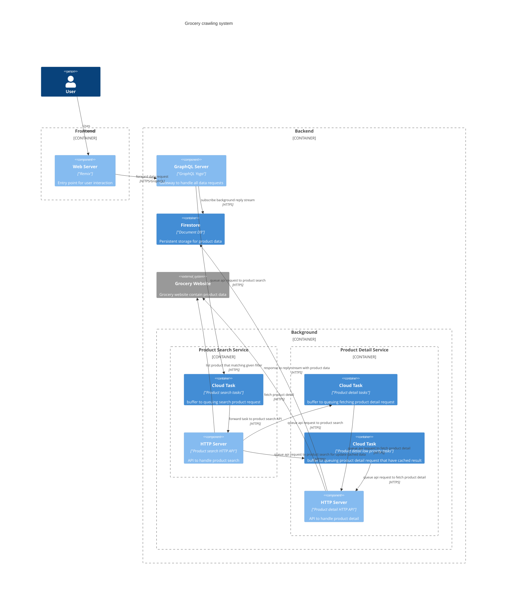
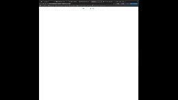
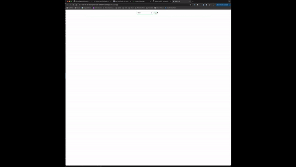

# Made in UK

Project aim to crawling UK main grocery website
for display their price and country of origin.

## Overview Architecture

Diagram below show the high level architecture of the system



## Working Copy

[Deployed website](https://made-in-uk-development-web-e955251-dxbhtl4gza-nw.a.run.app/)

### Working video

#### Search for noodle (No cache)



#### Search for beer (Cached before)



## Development

[Install docker compose](https://docs.docker.com/compose/install/)

### Start development server

```sh
bash ./scripts/dev.sh

Open http://localhost:5333 for dev
```

## Deployment

[Setup GCloud](https://cloud.google.com/sdk/docs/authorizing)

### Init GCP

Before deploy, you need to init GCP project

```sh
cd systems/infrastructure
# or production
bash ./scripts/init.sh development
```

After init, you can deploy though that script

```sh
# or production
bash ./scripts/deploy.sh development
```
