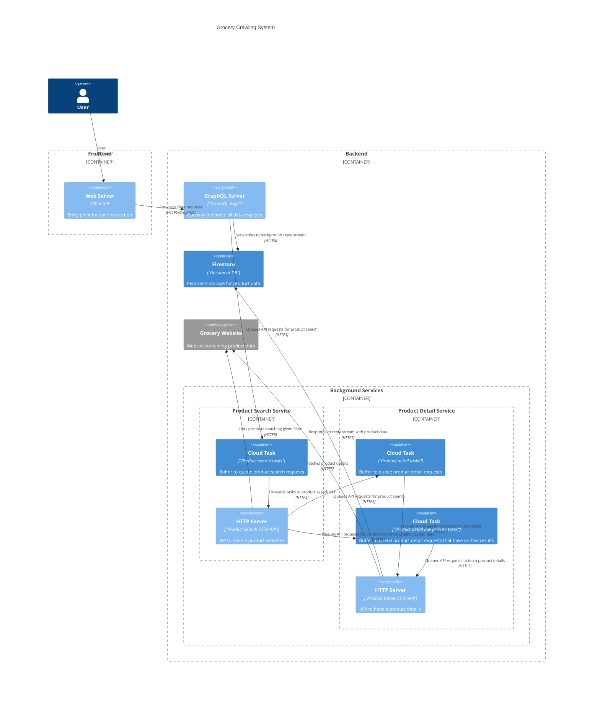

# Made in UK

The project aims to crawl the main UK grocery websites to display their prices and country of origin.

## Overview Architecture

The diagram below shows the high-level architecture of the system.



## Working Copy

[Deployed Website](https://made-in-uk-development-web-e955251-dxbhtl4gza-nw.a.run.app/)

### Working Videos

#### Search for Noodles (No Cache)

<https://github.com/neviaumi/made-in-uk/assets/2247500/d2d8d33e-315d-40ab-b45d-f99a6882e4c3>

#### Search for Beer (Cached Before)

<https://github.com/neviaumi/made-in-uk/assets/2247500/1c6b6a43-46f8-47e2-8e71-0eed7256e5ef>

## Development

[Install Docker Compose](https://docs.docker.com/compose/install/)

### Start Development Server

```sh
bash ./scripts/dev.sh

# Open http://localhost:5333 for development
```

## Deployment

[Setup GCloud](https://cloud.google.com/sdk/docs/authorizing)

### Initialize GCP

It may error about you need enable project on dashboard, just follow the link and enable the project.

You need manually enable the Firebase authentication on [firebase dashboard](https://console.firebase.google.com/)

```sh
# For development
bash ./scripts/deploy.sh development
# For production
bash ./scripts/deploy.sh production
```
