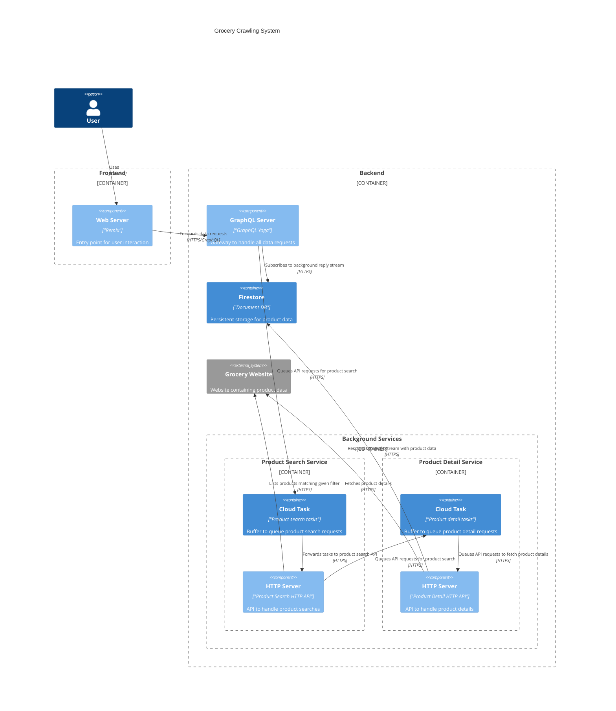

# Mall Search Architecture

The diagram below shows the high-level architecture of the system.

```mermaid
C4Component
    title Grocery Crawling System
    Person(user, "User")
Container_Boundary(frontend, "Frontend") {
Component(
    web, "Web Server",
"Remix", "Entry point for user interaction")
}
Container_Boundary(backend, "Backend") {
Component(
api, "GraphQL Server",
"GraphQL Yoga", "Gateway to handle all data requests")
Container(
database, "Firestore",
"Document DB", "Persistent storage for product data")
Container_Boundary(backgroundService, "Background Services") {
Container_Boundary(ProductSearchService, "Product Search Service") {
Container(
productSearchTaskQueue, "Cloud Task",
"Product search tasks", "Buffer to queue product search requests")
Component(
productSearchAPI, "HTTP Server",
"Product Search HTTP API", "API to handle product searches")
}
Container_Boundary(ProductDetailService, "Product Detail Service") {
Container(
productDetailTaskQueue, "Cloud Task",
"Product detail tasks", "Buffer to queue product detail requests")

Component(
productDetailAPI, "HTTP Server",
"Product Detail HTTP API", "API to handle product details")
}
    }
System_Ext(groceryWebsite, "Grocery Website", "Website containing product data")
}
Rel(user, web, "Uses", "Browser")
Rel(web, api, "Forwards data requests", "HTTPS/GraphQL")
Rel(api, database, "Subscribes to background reply stream", "HTTPS")
Rel(api, productSearchTaskQueue, "Queues API requests for product search", "HTTPS")
Rel(productSearchTaskQueue, productSearchAPI, "Forwards tasks to product search API", "HTTPS")
Rel(productSearchAPI, groceryWebsite, "Lists products matching given filter", "HTTPS")
Rel(productSearchAPI, productDetailTaskQueue, "Queues API requests for product search", "HTTPS")
Rel(productDetailTaskQueue, productDetailAPI, "Queues API requests to fetch product details", "HTTPS")
Rel(productDetailAPI, groceryWebsite, "Fetches product details", "HTTPS")
Rel(productDetailAPI, database, "Responds to reply stream with product data", "HTTPS")
```
